# Missables Checklist for Tales of Vesperia
- Author: [@tauke](https://twitter.com/tauke)
- Last updated: 12 July 2020
- Source: [Kouli's Guide - Tales of Vesperia](https://www.scribd.com/document/397057683/Kouli-s-Guide-Tov)

# Act One

## Zaphias
 - [ ] Automatically obtains __Wonder Log__ (Wonder Reporter Part 1)

## World Map
 - [ ] Near Zaphias, you can find the travelers' inn, __King Of Adventure__ (King Of Adventure Part 1)

## Deidon Hold
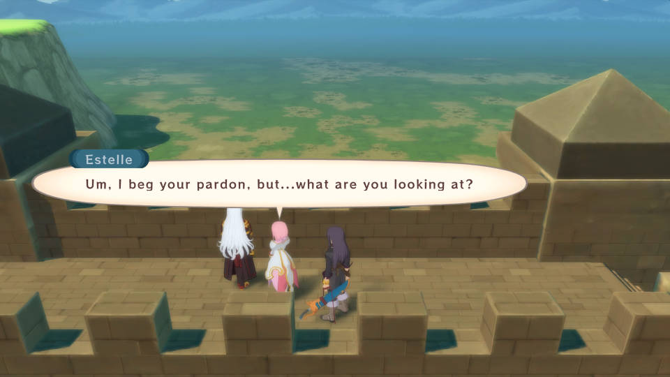

 - [ ] Find Duke on the roof of the Chevaliers' Station (Duke Part 1)

## After Karol joins the Party

 - [ ] With Karol in the party, go to the travelers' inn King Of Adventure. Rest to meet with Rich and make sure this is done ___BEFORE___ killing any upcoming Giganto Monster (King Of Adventure Part 2)

## Aspio

 - [ ] After Rita joins the party, check the second floor of Rita's House for __Collector's Book__ (Collector's Book Part 1)
 - [ ] After Shaikos Ruins and with Rita in the party, check a Blastia in Rita's House to name it Victoria. ___This should be done before getting the Golden Horn in the main story___ (Brionac Part 1)

## Ehmead Hill
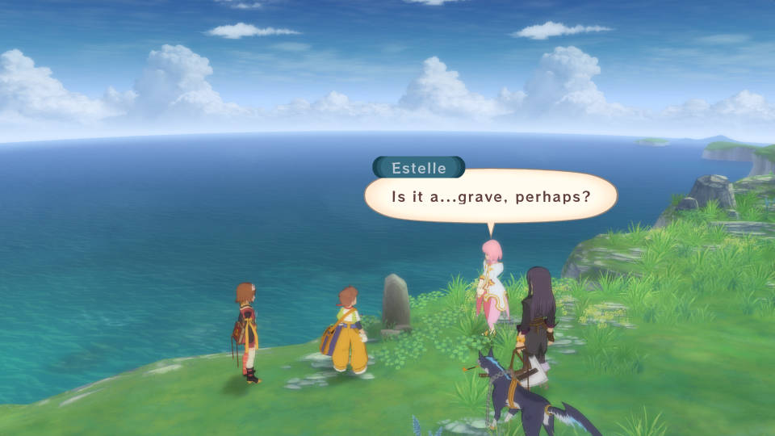

 - [ ] After Repede and Karol join back the party, get back to Halure and talk to the Elder near the tree (Under The Tree Part 1)
 - [ ] At the cliff, check the small grave stone. Further, you can go back to Halure and speak with the couple near the entrance (Elucifer's Grave Part 1)
 - [ ] After checking the grave, ___BACKTRACK___ toward the Blastia that is blocking the main road to name it Ekaterine. This is your only window of opportunity to trigger this event (Blastia Destroyer)

## Capua Nor
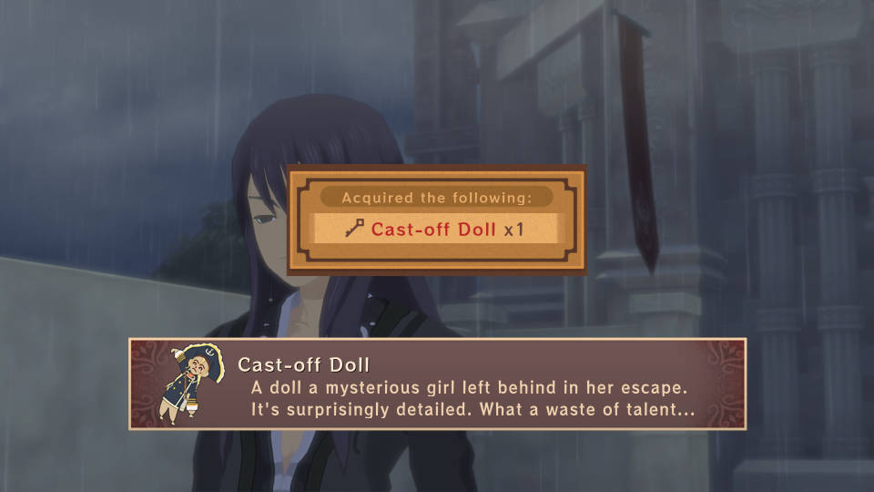

 - [ ] After meeting with Flynn, talk to Karol and Rita by the Inn. Before entering the Inn, go west to meet with Patty for the __Cast-off Doll__ (PS3 and Definitive Edition)
 - [ ] Beat Dice Game Master for Rita's New Dice Master title. In Part One, you can win Gel Set. In Part Two, you can win Bottle Set. In Part Three, you can win Super Gel Set (Dice Game)
 - [ ] In Ragou's Mansion, you will meet with Patty (PS3 and Definitive Edition)

## Capua Torim

 - [ ] Afterward, sleep at the Inn (Dark Enforcer Part 1)

## Caer Bocram

 - [ ]  Sun (Password)

## Heliord
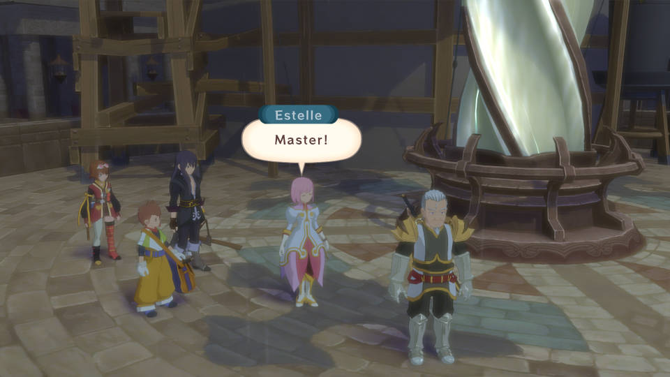

After Estelle joins back at the end:

 - [ ] Get near the Barrier Blastia to find Drake (Estelle's Teacher Part 1)
 - [ ] Enter the Chevaliers HQ to find Asciutto. The dialogue differs if you wait until Raven joins the party (Yuri And The Chevaliers)
 - [ ] Rest at the Inn (Laborer)
 - [ ] Go right just before the Inn to find the Wonder Reporter (Wonder Reporter Part 2)
 - [ ] Go back to Caer Bocram and head left to find Duke (Duke Part 2)

## Dahngrest
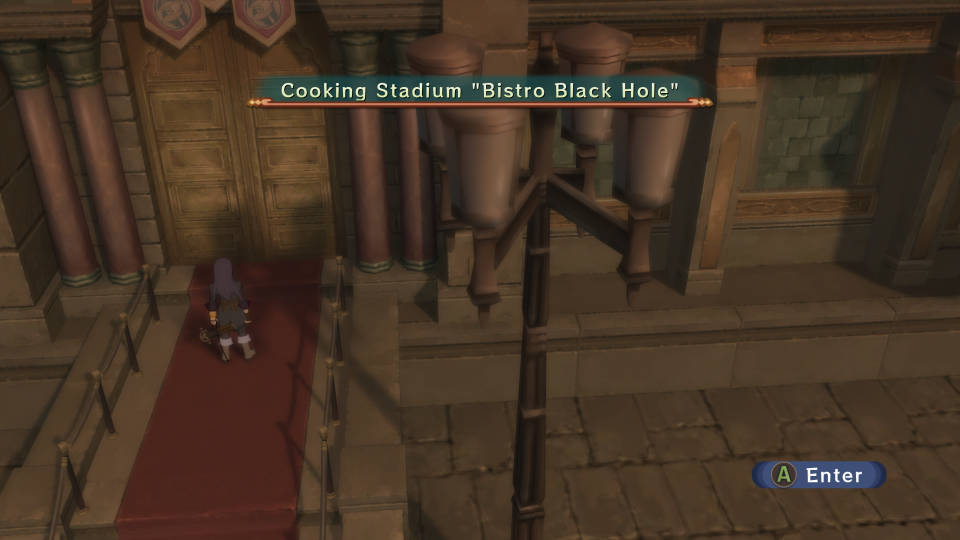

 - [ ] Before anything, you can enter the Bistro Black Hole (PS3 and Definitive Edition)
 - [ ] At the first area of the Union HQ, the Bunny Guild Leader shows up at the top left corner if you have 500 Title Points (each title has its respective point count). You can get Bunny Guild Badge and Female Bunny Ears with 500 Title Points. You can get more Attachment when you get more titles. You need at least 4000 Title Points to get everything. Make sure you come back when you have more titles (Bunny Guild)

## Keiv Moc

 - [ ] At the first intersection, go down to the left for Karol to learn __Bug Breath__ (Bug Hater)
 - [ ] Go on to the left from where Karol learns Bug Breath (Old Man's Wisdom)
 - [ ] If you have done (King Of Adventure Part 2) and from Where Karol learns Bug Breath, go down further to fight the Giganto __Green Menace__ (PS3 and Definitive Edition)
 - [ ] In the second area, you will meet Patty (PS3 and Definitive Edition)
 - [ ] After beating Gigalarva, back track to fight Don Whitehorse (99764 HP (Easy), 142520 HP (Normal), 356300 HP (Hard)). He can drop Diamond if you do beat him... ___in your next EX New Game playthrough___ (PS3 and Definitive Edition)

## Dahngrest

 - [ ] After Rita and Repede join back the party, enter the western bar and Raven will join the party. You will be in the Sewer Tunnels of Promise (PS3 and Definitive Edition)

## Ghasfarost

 - [ ] When you reunite with everyone, Flynn also joins the party temporarily (PS3 and Definitive Edition)

# Act Two

## Dahngrest

 - [ ] After exiting out Dahngrest, quickly enter back to find Duke (Duke Part 3)
 - [ ] After Judith and Estelle join back the party, go to Ghasfarost and check the east room on the first floor (Brionac Part 2)

## Capua Torim

 - [ ] At the right of the Fortune's Market HQ, speak with the female by the tree (The Dragoon Part 1)

## After Getting the Ship

 - [ ] In Capua Nor, sleep at the Inn to see Karol's Dream (PS3 and Definitive Edition)
 - [ ] At the north of Halure or west of Aspio, you can find the travelers' inn King Of Adventure. Talk to Rich if you have beaten Green Menace. Rest for more talk with Rich (King Of Adventure Part 3) (PS3 and Definitive Edition)
 - [ ] At the north of Halure or west of Aspio, you can find the travelers' inn King Of Adventure. Rest to meet with Rich and make sure this is done ___BEFORE___ killing any upcoming Giganto Monster (King Of Adventure Part 2)
 - [ ] In Halure, talk to the kids under the tree to get the attachment __Veil__ (Under The Tree Part 2)
 - [ ] In Halure, talk to Sicily before the Inn for Raven to learn __Arrivederci__ (Professor Sicily Part 1)
 - [ ] In Deidon Hold, arrange the Warehouse for Miracle Gel, Limits Bottle, Spicy Bottle and 2000 Gald as the reward (Tidy Up The Warehouse Part 1)
 - [ ] In Zaphias, talk to an Old Woman at the Lower Quarter. Go north to find Estelle and Rita. Go to the Nobles Quarter to find Estelle and Rita again (PS3 and Definitive Edition)
 - [ ] In Zaphias, head toward the Nobles Quarter. Go on to the west to talk to Sher again. Back track to the previous area and talk to Lune who is sitting on a bench. Yuri will learn __Tiger Blade__ and the __Kingdom Celeb__ title (Dark Enforcer Part 2)
 - [ ] In Capua Nor, go west and find Sicily for Raven to learn the __Vacance__ skill and his __Twilight Dreamer__ title (Professor Sicily Part 2)
 - [ ] In Capua Torim, arrange the Warehouse for Power Light, Golden Horn, Lottery Gel and 2000 Gald as the reward (Tidy Up The Warehouse Part 2)

## Ocean

 - [ ] Sail toward the west from Capua Nor/Torim. You will meet with Patty after fighting the Predafish (PS3 and Definitive Edition)

## Atherum

- [ ] Patty will join the party temporarily when the game switches to the second party (PS3 and Definitive Edition)
- [ ] When fighting Cursed Wanderer, attack and knock it down while it reloads its revolver (Secret Mission 8, PS3 and Definitive Edition)

## Capua Nor

- [ ] Check the back alley near the shop to find Dedecchi (PS3 and Definitive Edition)
- [ ] Talk to the Woman by the Inn for the __Seafood Bowl__ recipe. The dialogue differs if you have done (Yuri And The Chevaliers) (Seafood Bowl Recipe)

## Capua Torim

- [ ] Go toward the Harbor to get the __Marking Map__ and Repede's __Fated One__ title. In Zaphias, talk to a dog at the right side of the shop to get the __Friendship Fur Ball__. Upon 50% completion of the Dog Map, a scene will trigger automatically on the world map (Dog Map Part 1)

## Nordopolica
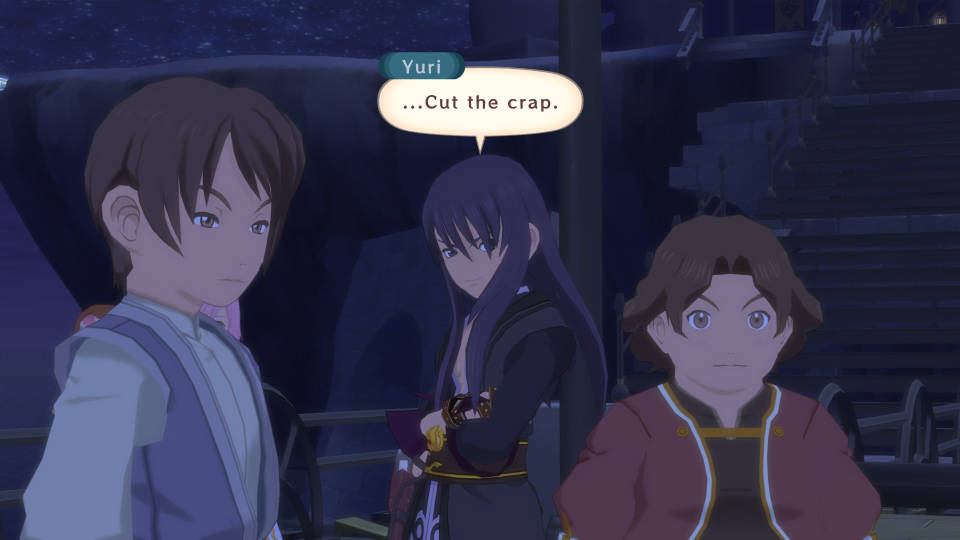

- [ ] Speak with the fish seller (The Dragoon Part 2)
- [ ] Find Drake on the way to the north (Estelle's Teacher Part 2)
- [ ] After talking to Natts, go toward the Harbor to meet with Patty (PS3 and Definitive Edition)
- [ ] After resting at the inn and Raven joins back the party, you can find Duke at the reception area of the arena (Duke Part 4)
- [ ] After resting at the inn and Raven joins back the party, talk to the couple at the southern part of the town. Rest at the Inn for Yuri to learn __Shining Eagle__ (Dark Enforcer Part 3)

## Weasand Of Cados

- [ ] At the second area, Patty joins the party temporarily (PS3 and Definitive Edition)
- [ ] Afterward, enter back and head toward the Aer Krene to find Duke (Duke Part 5)

## Mantaic

- [ ] Find Wonder Reporter near the tree by the middle intersection (Wonder Reporter Final Part)
- [ ] Before resting at the Inn, you can find Patty at NE (PS3 and Definitive Edition)
- [ ] After resting at the Inn, rest for Judith to learn Moonlight Talon (Moonlight Talon)
- [ ] After resting at the Inn, rest to get __Mother's Memento__ aka ___don't miss out on this or forfeit the chance complete a later Secret Mission for the entire playthrough___ (Estelle's Precious Thing)

## Sands Of Kogorh

- [ ] At the third area, __Patty joins the party PERMANENTLY__ (PS3 and Definitive Edition)

## Revisiting Mantaic after Yormgen

- [ ] Speak with the kids at NE for Hourglass, Miracle Gel or Mix Gel (Reward For Helping Others)
- [ ] After the event with Flynn by the lake, reenter Mantaic and take the right path near the Inn to speak with the Cow Boy. Hand over Apple Gel for Milk (Cow Boy Part 1)

## After Nordopolica Events

- [ ] Return to Heliord and talk to the two near the eastern entrance/exit. Patty will learn __Search Gald__ and obtain the __Gald Hunter__ title (PS3 and Definitive Edition)
- [ ] Return to Zaphias and head into Yuri's Room to get __Bread__ from Ted (Yuri's Downtown Life)

## After the Death Of Don

- [ ] In Dahngrest, enter the western bar and you will get the __Imperial Crest__ from Drake (Estelle's Teacher Part 3)
- [ ] In Dahngrest, sleep at the Inn for Karol's __Insomniac__ title (Sleepless Night)
- [ ] In Dahngrest, sleep at the Inn and there is a 100% chance that you will get a scene. Repeat this for four scenes in total. Karol will learn the Special skill which enables him to use Mystic Artes (Hard Working Boy)
- [ ] Enter the Shaikos Ruins (Truth Of Ruin's Gate Part 1)

## After Getting Baul

- [ ] In Mantaic, go north to find the Dispatcher. Talk to Yu near the Inn to get __Book of Friendship__ and __Comrade Crest__. Go to the Inn in Capua Torim and speak to Nobis to get __Rainbow Bookmark__. Report back to Yu in Mantaic for 3000 Gald (Guild Quest Part 1)
- [ ] If you have done (Bug Hater), go to Mantaic to rest at the Inn and pick Yes (Portrait Of Nan)
- [ ] In Mantaic, hand over Trident for Rice, Potato, Onion and Carrot (Cow Boy Part 2)
- [ ] In Mantaic, go north and speak with Clay. Sleep at the Inn and go north (Dark Enforcer Part 4)
- [ ] In Nordopolica, head towards the entrance to the Colosseum (Truth Of Ruin's Gate Final Part)
- [ ] In Nordopolica, head towards the Arena and speak with Natts (After The Death Of Belius)
- [ ] In Nordopolica, the Arena is now open. Clear 30 Man, 50 Man and 80 Man Melee for now (Arena Part 1)
- [ ] In Nordopolica, if you have cooked 600 times and Patty has three recipes MASTERED, talk to the person to the right of the Shop (PS3 and Definitive Edition)
- [ ] In Ehmead Hill, go toward the grave on the cliff to find Duke (Elucifer's Grave Final Part)
- [ ] Enter Ehmead Hill from the western entrance/exit. Go north, east and north to get the Fire Lilly (Avenging Soldiers Part 1)
- [ ] Enter Ehmead Hill from the eastern entrance/exit. Go toward the Blastia that is blocking the main road. Head to Aspio and check the bookshelf in the library for __Hermes' Notes__. Go to Capua Torim and rest at the Inn to learn Negative Gate. If you are to do this later in the game, you can get Hermes Memo from a Mage in the Inn of Capua Torim (Study Of Hermes Part 1)
- [ ] In Capua Nor, you can find Nan if you have ___completed 50% of the Monster Book___ (Monster Book Part 1)
- [ ] In Capua Torim, toward the right of the Fortune's Market HQ. Speak with the Female by the tree (The Dragoon Final Part)
- [ ] In Capua Torim, speak with Kaufman in the Fortune's Market HQ. Go to Dahngrest and enter the right shop to speak with the Owner (Brionac Part 3)
- [ ] In Dahngrest, ___if you haven't done it___, sleep at the Inn and there is a 33% chance that you will get a scene. Repeat this for four scenes in total. Karol will learn the Special skill which enables him to use Mystic Artes (Hard Working Boy)
- [ ] In Dahngrest, enter the western bar. Exit out and talk to the Girl that is at the center of the town. Enter the eastern bar and talk to another Girl. Head toward the Union HQ to get Raven's __Ladies' Man__ title (Ladies' Man)
- [ ] In Dahngrest, enter the western bar and talk to Sassoon at the upper left corner. You can get various Attachment/Title based on what you have. Be sure to check out with her frequently (PS3 and Definitive Edition)
- [ ] In Dahngrest, go to the Union HQ and go find Kaufman in the Fortune's Market in Capua Torim (Rebuilding The Union Part 1)

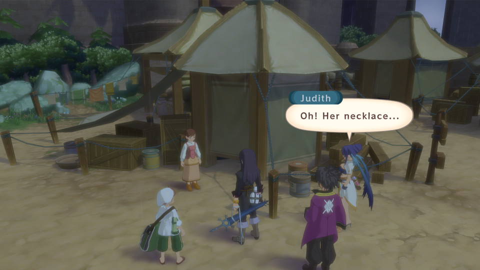

- [ ] In Dahngrest, enter the western bar and speak with the right Bartender. Go to the Inn to speak with Rhianna. Exit out and go toward the lower right bridge. Go to Heliord and head down to the lower section to talk to a Girl. Trade __Bird Feather (Small)__ for the __Everlight Necklace__. Report back to Rhianna at the Inn of Dahngrest (Guild Quest Part 2)
- [ ] In Dahngrest, enter the western bar and speak with the middle Bartender. Clear all three levels with everyone except Yuri, Patty and Repede for the __Waiter/Waitress__ series titles. When you play the Waiter/Waitress Game at latter part of the game, you can win more Gald (Waiter/Waitress Game)

## After Meeting Phaeroh

- [ ] To get the __Guide Bell to Myorzo__, you need to go to Renansula Hollow after revisiting Aspio and speak with Tort as Judith (PS3 and Definitive Edition)

## Renansula Hollow

- [ ] Around the middle of the Hypionia Continent, look for a beach with red flowers (PS3 and Definitive Edition)

## Myorzo

- [ ] Arrange the Warehouse for Hourglass, All Divide (Dragoon Boots In PS3 and Definitive Edition), Flare Stone, Freeze Stone, Aer Stone, Geo Stone and 2000 Gald as the reward (Tidy Up The Warehouse Part 3)
- [ ] After Judith gets the __Guardian Of Truth__ title, rest at the northeastern house (Entelexia)

## Yormgen

- [ ] Flynn joins the party temporarily (PS3 and Definitive Edition)

## With Flynn in the Party

- [ ] In Mantaic, go toward the west to get Flynn's __Mark of Knighthood__ title (PS3 and Definitive Edition)

## Baction

- [ ] In the dark area, ___fall down three times___ to get __Magic Lantern__ (Magic Lantern)

## Before heading to Zaphias for Estelle

- [ ] After the events at Halure and Quoi Woods, go to Deidon Hold and find Duke on the roof of the Chevaliers' Station (Duke Part 6)

## After Estelle Joins Back

- [ ] When everyone joins back at Zaphias, Flynn joins the party temporarily (PS3 and Definitive Edition)
- [ ] In Mt Temza, head up for __Compact of Remembrance__ (Avenging Soldiers Part 2)
- [ ] In Phaeroh's Crag, approach the __Phantom Rift__. Within Yormgen, speak with the Sage within the NW house and choose to rest when prompted (Extra Dungeon Part 1)
- [ ] At the NW of the World Map, you can find __Yumanju__ at the further north of Mt Temza. Speak with the Receptionist and that is it for now. In the meantime, prepare 900000 Gald (Hotspring Part 1)
- [ ] In Mantaic, speak with the Cow Boy. Hand over Poison Ward, Paralyze Ward and Stone Ward for __Flare Cape__ (Cow Boy Part 3)
- [ ] In Myorzo, obtain the __Abyssion__ from the Elder (Fell Arms Part 1)
- [ ] In Nordopolica, arrange the Warehouse for Specific, Paralyze Charm, Treat and 2000 Gald as the reward (Tidy Up The Warehouse Part 4)
- [ ] In Capua Nor, go west to find Duke (Duke Final Part)
- [ ] In Capua Torim, head towards the port to get the ship modified with __Salvage Crane__ and the ability to __sail on shallow area__ (Professor Sicily Part 3)
- [ ] In Capua Torim, speak with the Round Spectacle Old Man to the right of the western stairs (standing in front of the ice-cream stall). You need seven kinds of Food Materials which you can buy at the shops (the shop at Yumanju carries every Food Materials). For the knife, you need __Sharp Blade__ and __Flare Stone__. Go to the western bar in Dahngrest, talk to the right Bartender for the __Kitchen Knife__. Report back to the Old Man for the __Seafood Stew__ recipe (PS3 and Definitive Edition)
- [ ] Once you have obtained the Salvage Crane, go to Capua Nor and head towards the signboard on the west. Accept to pay and exit out. At the NW of Zaude, there is a Harvest Point. Sail to it and check for a scene (PS3 and Definitive Edition)
- [ ] In Heliord, speak with Pauly near the Blastia. Go east and defeat the enemies for Repede's Special skill which enables Mystic Artes and Repede's __Nanny__ title (Children Lover)
- [ ] In Dahngrest, head toward the Inn. Flynn gets the __Emperor Of The Night__ title (PS3 and Definitive Edition)

## Zaude
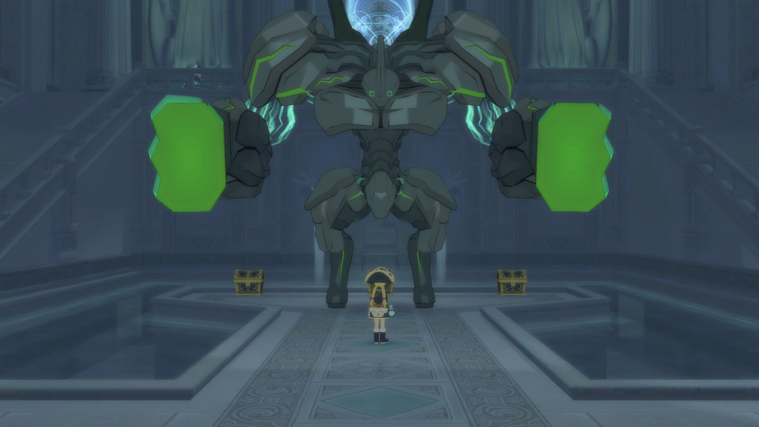

- [ ] At the area with the Giganto, go up near the Main Gate for the __Maris Stella__. This is needed for Secret Mission 20 (PS3 and Definitive Edition)

# Act Three

## After Everyone Joins Back

- [ ] In Zaphias, talk to LeBlanc for Raven's __Imperial Knights Captain__ title (Rebuilding The Union Part 2)
- [ ] In Zaphias, head toward the Nobles Quarter (Dark Enforcer Part 5)
- [ ] In Deidon Hold, talk to the Man near the tents to play __Repede's Pro Snowboarding__ minigame. Clear it in short amount of time then quit the minigame for Repede's __Snow Delivery Dog__. When clearing the other courses, Repede needs to equip specific Overdrive Attachment to match the Referees of the course (PS3 and Definitive Edition)
- [ ] In Myorzo, enter the Elder's House. Check the stand before the back wall to get the __Bush Baby Doll__. Go to Aspio and speak with Tort for Estelle to learn __Astion__. If you are to do this later in the game, go to Deidon Hold instead of Aspio (Krytian Style Fighting)
- [ ] In Myorzo, ___after finishing the above sidequest___, enter the Elder's House. Check the stand before the back wall (Feelings In The Mural)
- [ ] In Yumanju, pay 300000 Gald. After, sleep at any Inn and come back to Pay 600000 Gald (Hotspring Part 2)
- [ ] Fly toward the top of Mt Temza to trigger a scene (Dragon Race Part 1)
- [ ] In Mantaic, speak with the Cow Boy. Hand over Hourglass and All Divide for Gel Set (Cow Boy Part 4)
- [ ] In Capua Torim, toward the port to find Gauche and Droite. Go to Zaude and head to where you fought against Yeager to fight Gauche and Droite. While fighting them, be sure to ___steal___ __Gauche Sword__ and __Droite Sword__. After beating them, you will get __Letter of Challenge (L. Claw)__ and __Divine Cannon__ for Raven. With the Letter of Challenge (L. Claw), you can unlock 100 Man Melee in the Arena. However, don't clear 100 Man Melee because you won't get the full reward unless you have the Letter of Challenge (H. Blades) (Avenging Soldiers Final Part)
- [ ] In Capua Torim, speak with the Woman in front of the floral stall.  Donate 500,000 Gald and attempt to exit town through the west to get Estelle's __Noble Princess__ title (Estelle's Teacher Part 4)
- [ ] In Heliord, go down to the Lower Section. You can find Sicily by the river. After the cutscene, fight at least ten battles and return back to the same spot where Sicily is. You can find the Robot near the eastern tent (Professor Sicily Part 4)
- [ ] In Heliord, get near the Blastia __Addendum: Need to be done at night__ (PS3 and Definitive Edition)
- [ ] In Heliord, speak with the Shop Owner. Take your time to gather the raw materials to get title for Judith, Estelle and Karol as some of the materials are not accessible yet (Sexy Clothes)
- [ ] In Dahngrest, enter the eastern shop and talk to the Soldier. Be sure to get the __Klonoa figurine__ I mean __(C) F Statue__ from the chest (Favorite Toys Part 1)

- [ ] In Dahngrest, talk to the right Bartender in the western bar to get __Basement Key__. Head to Ghasfarost using the main entrance. Use the key on the left lever and shoot it with Sorcerer Ring to lower down the stairs. You will get the __False Dein Nomos__ in the basement (Alexei's Research)
- [ ] In Dahngrest, talk to Yu by the eastern entrance/exit. Head to the port in Capua Torim and talk to Nobis near by the western entrance/exit of Capua Torim in PS3 and Definitive Edition). Go back to Dahngrest and head in the Inn. Go to the last area of Mt Temza and check the east of the green warp for Everlight Ore. __DO NOT USE THE WARP AS IT WILL SKIP A MISSABLE CUTSCENE__. Instead run all the way back to the exit for a cutscene. Report back to Nobis in Capua Torim for 5000 Gald (Guild Quest Part 3)
- [ ] In Dahngrest, talk to the right Bartender in the western bar. Go to Zaphias and speak with LeBlanc by the fountain. Head in the Inn and speak with Mimula (that resembles Cumore) by the counter. Go to the Manor of the Wicked and head back to Dahngrest. Speak with Yu by the eastern entrance/exit for __Letter to Leviathan's Claw__. Go back to the Manor of the Wicked and travel to Zaphias one more time. Go south toward the Inn and speak with Mimula and Sebastian next to the save point. Pick the second choice and speak with LeBlanc by the fountain. Go report back to the right Bartender in Dahngrest for 6000 Gald (Guild Quest Part 4)
- [ ] In Dahngrest, talk to the right Bartender in the western bar. Go to the Union HQ and speak with the two at the upper right corner. Head to Baction and after going down the ladder, head up to north. With the Sorcerer Ring Level 3, break through walls to make it to B2F. Head to the room that is at the west of the most SE room (refer to screenshot). You will find the __Shovel__. Report back to the two in the Union HQ for 5500 Gald (Guild Quest Part 5)

## After The Birth Of Undine
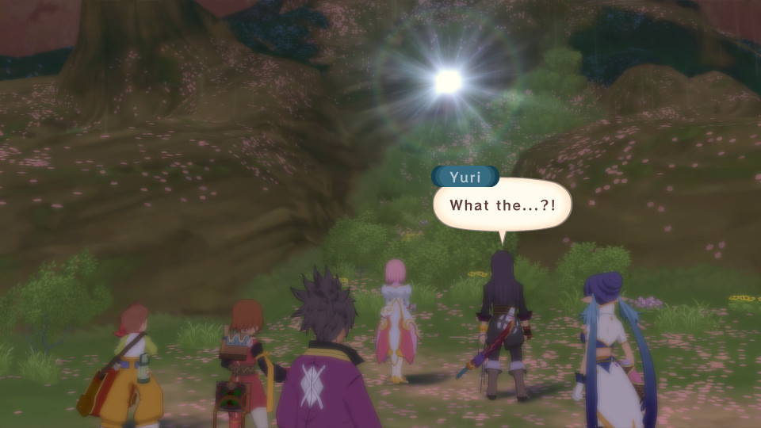

- [ ] In Zaphias, head toward the Nobles Quarter for Yuri's __Dark Enforcer__ title (Dark Enforcer Part 6)
- [ ] In Halure, speak with the kids under the tree to get Estelle's __Fairy Tale Weaver__ title (Under The Tree Part 3)
- [ ] In Halure, _after completing the above_, get near the tree for Estelle to learn __Force Field__ (Under The Tree Part 4)
- [ ] In Myorzo, head to the second area. Speak with the Kid at the lower right to play the Dragon Race. Clear Level 3 to get Clones Dew which will power up Baul automatically. If you clear Level 5, you can get __Ultimate Red Cape__ and Judith's __Super Dragon Rider__ title. If you have done at least 1000 Fatal Strike Chains, rest at the Inn then speak with the Kid for Judith's __Into The Sky__ title (Dragon Race Final Part)

## After Fending Off Nordopolica From Threats

- [ ] In Aspio, head towards the center. Rest at the Inn at least twice and revisit the center again for Rita to learn __Meteor Storm__. If you are to activate this later in the game, go to Halure instead (Spirit Magic Part 1)
- [ ] In Dahngrest, rest at the Inn (Raven And The Heart Blastia)
- [ ] In Myorzo, speak with the Elder (Judith's Sundering Moon Part 1)
- [ ] If you have finished (Sexy Clothes) __Addendum: The crafting materials are pretty much impossible for first-time playthrough at this point so don't sweat it as you can revisit this missable later__, sail to the near west of Nordopolica and check the Harvest Point for Patty's __Glamorous Walker__ title (PS3 and Definitive Edition)

## After Getting All Four Spirits

- [ ] A scene will trigger while flying around with Baul (Anxiety Of Spiritization)
- [ ] At the SE of Weasand Of Cados, you can find the Four Sisters Islands. Head in the rock formation on one of the islands. You will get __Zarich__ and head inside for Sorcerer Ring Level 4 (Fell Arms Part 2)
- [ ] With Sorcerer Ring Level 4, explore Keiv Moc thoroughly for more items. You can also find __Nebilim__ in one of the chests (Fell Arms Part 3)
- [ ] With Sorcerer Ring Level 4, explore Relewiese Hollow thoroughly for more items. You can also find __Mercurius__ in one of the chests (Fell Arms Part 4)
- [ ] With Sorcerer Ring Level 4, go back to Quoi Forest. From the eastern entrance/exit, go west a bit and look out for rotten grass. Burn them to an area where you can find __Glasya Labolas__ in a chest behind the Giganto Monster (Fell Arms Part 5)
- [ ] Before you go on any further, make sure you have at least completed 50% of the Collector's Book. Walk up the stairs in the west house in Aspio. Later, when you have completed 100% of the Collector's Book, head toward the fountain at the west in Halure. You will get Limits Bottle and Estelle's Item Mania title. Make sure you at least activate the part in Aspio NOW because you are JUST before the deadline (Collector's Book Final Part)

## Resting at Capua Nor (PS3/Definitive Edition)

- [ ] When Patty goes off at nighttime, follow her to the west and toward the port behind the mansion. Get on the boat to the Atherum. Go up to the deck and when fighting Cursed Wanderer, ___use the Maris Stella___ (Secret Mission 20, PS3 and Definitive Edition)

## After Capua Nor

- [ ] In Zaphias, enter Estelle's Room in the Castle to hear about the City of the Waning Moon. Go to the last area in Zaude and you will be able to enter the Necropolis of Nostalgia. At the first area, __Firmament__, you can find Flynn's Fell Weapon __Seven-Branched Blade__ at the NW of the 8F. At the second area, __Existence__, you can find Patty's Fell Weapon __Corbis__ at the SE of 9F. After beating __Ohma__, you won't be able to advance further until you have beaten the game (PS3 and Definitive Edition)
- [ ] In Zaphias, head down toward the Fountain in Lower Quarter from the top of the slope. After that, head towards the Castle. In the PS3 and Definitive Edition, enter through the Lower Quarter before heading to the Castle (Future Of Blastia)
- [ ] In Zaphias, sleep in Yuri's Room to trigger a scene where Rita gets __Estelle's Best Friend__ title while Estelle gets __Best Friends__ title (PS3 and Definitive Edition)

- [ ] Fly to the Wecca Continent and land at the SE Part. You can encounter the Giganto __Bloody Beak__ (PS3 and Definitive Edition)
- [ ] After beating all eleven Giganto Monsters, go back to speak with Rich for Karol's __Valiant Swordsman__ title. Go back to Capua Torim to speak with Rich's Father and report back to Rich (King Of Adventure Part 3)
- [ ] In Capua Torim, you can enter the Lighthouse which is Patty's Home (PS3 and Definitive Edition)
- [ ] In Nam Cobanda Isle, talk to the Cow Boy at NE. For 300 Chips, you can fight specific bosses for any missed Secret Mission. However, you don't get any Grade, Item, EXP and Gald (PS3 and Definitive Edition)
- [ ] In Nam Cobanda Isle, enter the Gym. Speak with the Cow Boy at the Chip Exchange, Poker Table and the Ant Lion by the Toy Machines. Use over 250000 worth of Chips to trade in Prizes for Judith's __Poker Face__ title. Exit out the Gym and enter the Shoe Locker room (Poker Face)
- [ ] In Nam Cobanda Isle, enter the Gym and speak with the Cow Boy at the Poker Table if you haven't done so yet. Exit out and enter back the Gym to trigger the scene with Kaufman. Whether you win or lose the match, Judith will get the __Legendary Gambler__ title (Gamble Life)
- [ ] In Nam Cobanda Isle, speak with the Ant Lion near the entrance/exit after you have done (Favorite Toys Final Part). If you have opened up 445 (86%) Treasure Boxes, you will get Yuri's Treasure Hunter title (Treasure Hunter)

> __FAVORITE TOYS SIDEQUEST NOTE:__ For PS3 and Definitive Edition, you need to wait until Flynn joins the party permanently for Hanks to show up in Zaphias.

- [ ] Go to Yumanju and speak with the Man at the upper left for the Tiara. Check the upper left Toy Machine in Yumanju for three statues. Go to Zaphias and speak with Hanks for one more statue. For the last six statues, you get them through the Toy Machines in the Gym of Nam Cobanda Isle. There is one statue each from 10 Chip Machine and 500 Chip Machine then two statues each from 100 Chip Machine and 50 Chip Machine. With all the statues, report back to the Man in Yumanju for Yuri's __Recollection Guardian__ title (Favorite Toys Final Part)

## After Flynn Leaves the Party (Fetching Leaders)

- [ ] In Dahngrest, you can meet with Dyne a bit north from the Inn. Go toward the intersection in Mantaic and go to Mt Temza to fight the Giganto Monster. Go back to speak with Dyne at the intersection in Mantaic (Guild Quest Part 6)
- [ ] In Capua Torim, sleep at the Inn to see Karol's Dream. __Addendum: Karol must have the Girly costume title and not wearing it before sleeping at the Inn__  (PS3 and Definitive Edition)
- [ ] In Nam Cobanda Isle, head in the Gym and speak with the Woman near the Stage to get the Drama Series titles, Estelle's __Hero's Sword__ and __Shield of Valor__ (Drama Lovers)

## VS Flynn
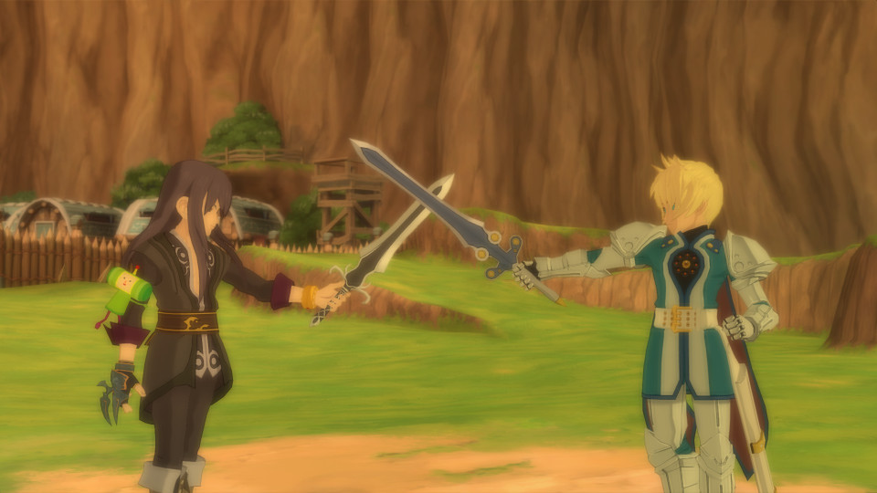

- [ ] Flynn must use every artes to unlock Secret Mission 23. In PS3 and Definitive Edition, Flynn will use his Mystic Arte, ___Radiant Dragon Fang___ that are triggered when Yuri uses Mystic Arte.

The best way to unlock the Secret Mission is to equip __Compact Sword +1__ which has the Minimum Damage skill to prolong the battle. Once unlocked, switch to a better weapon to finish off the battle. Alternatively, you can redo this battle for the Secret Mission achievement at Nam Cobanda Isle.
 
Here's the list of artes (thanks to __Massicot__ from ResetEra!):

- [ ] Rising Falcon
- [ ] Sonic Thrust
- [ ] Dragon Swarm
- [ ] Hell Fire Blade
- [ ] Tiger Blade
- [ ] Shining Falcon
- [ ] Beast
- [ ] Severing Blade
- [ ] Demon Fang
- [ ] Demonic Chaos
- [ ] Demonic Circle
- [ ] First Aid (Heal)
- [ ] Guardian Field (Heal)
- [ ] Holy Lance (Spell Arte)
- [ ] Luminant Scythe (Spell Arte)
- [ ] Radiant Dragon Fang (Mystic Arte)

## After Aurnion
> __NOTE:__ Aurnion is a classic JRPG example where there are many sidequests that may or may not trigger depending on your progress. Do complete more sidequests (possibly out of order) if a sidequest failed to trigger.

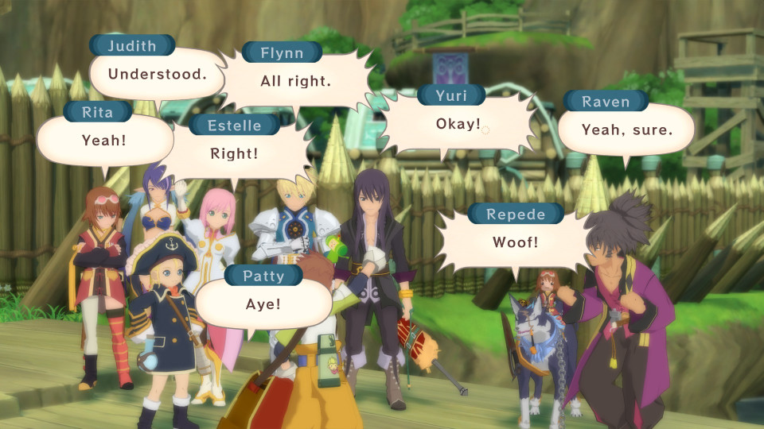

- [ ] You will obtain __Vesperia No.2__ and Flynn joins the party __PERMANENTLY__ (PS3 and Definitive Edition)
- [ ] Enter Aurnion and Yuri will learn __Final Gale__ from Flynn (Sword Friend)
- [ ] Rest at the Inn for a scene between the Spirits (Conversation between the Spirits)
- [ ] Sail to the west of the Manor of the Wicked to find a Harvest Point. Check it to get the __Leoluca__ for Patty (PS3)
- [ ] In Zaphias, enter the Inn for Patty's __Amazing Chef__ title (PS3 and Definitive Edition)
- [ ] In Zaphias, check the Fountain (PS3 and Definitive Edition)
- [ ] In Zaphias, approach the sitting bench on the right side in the Public Quarter for a scene with Lune (Dark Enforcer Final Part)
- [ ] Enter Keiv Moc to get __Letter of Challenge (H. Blades)__ and Karol's __Golden Soldier__ title. With the Letter of Challenge (H. Blades) and if you have cleared (Avenging Soldiers Final Part) previously, you may clear the 100 Man Melee and get the reward. Be sure to clear 100 Man Melee with at least three characters since it is one of the conditions to unlock 200 Man Melee (Golden Soldier)
- [ ] If you enter the 100 Man Melee with Flynn, you will fight Yuri at the end (PS3 and Definitive Edition)
- [ ] If you talk to the left Receptionist at the Arena, you can enter the __Tag Team Tournament - Challenger__ (PS3 and Definitive Edition)

- [ ] Enter Aurnion for the __Letter of Challenge (Flynn)__ (Rest at Yuri's Room in Zaphias for the PS3 and Definitive Edition). If you have cleared (Golden Soldier) and (Avenging Soldiers Final Part), you have three out of the four Invitations now (Arena Final Part)
- [ ] Enter Halure (Under The Tree Final Part)

- [ ] In Halure, toward the tree and speak with a Mage on the way if your party has inflicted over 60000000 damage in total. You will get Rita's __Seeker__ title (Seeker)
- [ ] In Heliord, go down to the Lower Section. Find Sicily by the river for __Murakumo__ if Repede is above Level 50. You will get this together with Repede's Joke Weapon at Halure after fulfilling Repede's motivational sidequest if you miss the scene (Professor Sicily Part 5)

- [ ] In Halure, speak with Sicily near the Inn for __Joke Weapons__ if you have completed the requirement. In the PS3 and Definitive Edition, you need to clear the 30 Man Melee under 90 seconds for Flynn and synthesis two hundred times for Patty (Professor Sicily Final Part)
- [ ] In Capua Nor, you can find Nan if you have completed 100% of the Monster Book. You will get Karol's __Manly Man__ title (Monster Book Final Part)

- [ ] In Capua Torim, talk to the Sailor near the slide. Patty will learn __Critical Moment__ (PS3 and Definitive Edition)
- [ ] Enter Capua Torim from the western entrance/exit for Karol to learn __Rending Drop__ (One Night Training)
- [ ] In Caer Bocram, go north then go west all the way to fight Clint. You will get the __Letter of Challenge (H. Blades) 2__ (PS3 and Definitive Edition)
- [ ] With the Letter of Challenge (H. Blades) 2 and if you have cleared __Tag Team Tournament - Challenger__ at the Arena, you will unlock __Tag Team Tournament - Hero__.
- [ ] Clear __Tag Team Tournament - Hero__ _Without Karol in the party_. Make sure to save before entering the tournament. After clearing the tournament, you will be awarded with Karol's __Small Knight__ title. If you do this fight even once with Karol in the party, you will not be able to obtain the title on this playthrough unless you load an older save files. If you don't have Karol and Raven in the Active Party, you will fight them in __Tag Team Tournament - Hero__ (PS3 and Definitive Edition)
- [ ] In Heliord, go down to the Lower Section and talk to Witcher. Barrelow X will be modified which unlocks Karol's second Mystic Artes, __Mega Flashbang Ultra X Bomber__ (PS3 and Definitive Edition)
- [ ] After (One Night Training), go to Dahngrest. Head towards the central area and pick either choice for Karol's very own Keyblade I mean __Infinity__ (Big Voice Contest)
- [ ] After obtaining all recipes from Wonder Chef and unlocking recipes, go to the Port in Nordopolica to talk to Wonder Chef for __Mabo Curry recipe__ and the __Cooking Match Invitation__. Go to Dahngrest to enter The Bistro Black Hole. The participant should have __MASTERED__ every HP/TP Recovery recipes and at least Three Stars for the other recipes. That will win you the Cooking Series titles (Cooking Battle)
- [ ] In Yormgen, check the Red Box (Illusion)
- [ ] In Yormgen, speak with the Butler of the Nobles. Enter the Zopheir Rift from the west and you will see the Micro Circuit. Report back and the male characters will get their Swimsuit Series titles. Talk to the Butler and go to Halure. Go west and talk to Giovanni near the Fountain for the Super Aer Board. Report back and the female characters will get their Swimsuit Seies titles (PS3 and Definitive Edition)

- [ ] Go to Mt Temza and head to the third area for Judith's __Sundering Moon__ (Judith's Sundering Moon Final Part)
- [ ] Fly to the Yurzorea Continent East and enter the rock formation for the Sorcerer Ring Level 5 (Fell Arms Part 6)
- [ ] In Yumanju, you can get the Hotspring Series titles (Hotspring Part 3)
- [ ] In Aurnion, toward the left of the Blastia when Repede is at least Level 60 to get Repede's __Tough Hound__ title (Tough Hound)
- [ ] After (Tough Hound), sleep at King Of Adventure twice to get Repede's __Shining Fang__, __Order of the Loyal Hound__ and Repede's __Ultimate Dog Warrior__ title (King Of Adventure Final Part)
- [ ] In Aurnion, find Drake at NW for Yuri's __Certified Soldier__ title (Estelle's Teacher Part 5)
- [ ] Enter Aurnion and you will get Raven's __Shining Star__ title if Raven has at least 100 Skills (Encouragement Of The Schwann Team Part 1)
- [ ] In Aurnion, speak with the Doctor in the Inn. Reenter the Inn and speak with the Doctor again. Speak with the Man that is near the Inn Owner. Once your party have healed at least 4000000 HPs, toward the Inn for Estelle's __Dedicated Paramedic__ title (Dedicated Paramedic)
- [ ] In Aurnion, if you have done (Estelle's Teacher Part 5) then talk to Drake at NE for Flynn's __Ideal Commandant__ title (PS3 and Definitive Edition)

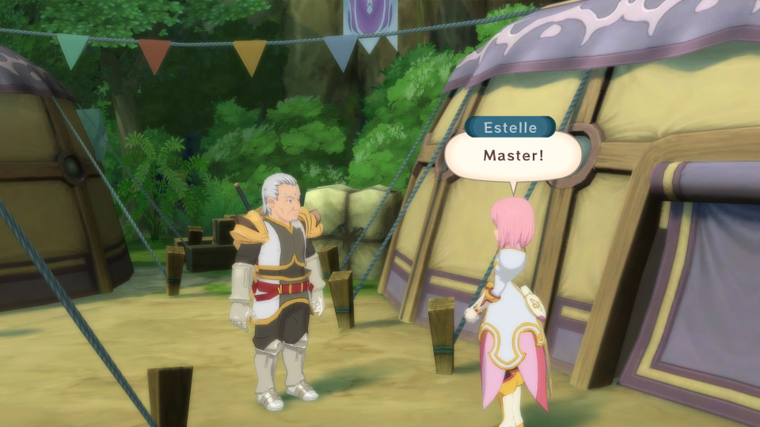

- [ ] In Aurnion, find Drake at NE for Estelle's __Worldly Adventurer__ title (Estelle's Teacher Part 6)
- [ ] Set Raven as the On Screen Character and enter Aurnion. Speak with Drake at the right of the Blastia for Raven's Vanji Lost (Rebuilding The Union Final Part)
- [ ] In Nam Cobanda Isle, speak with Miska in the Gym. To retrieve the five books, search the Elder's Home in Halure, Chevaliers HQ in Heliord, Inn in Mantaic, Chevaliers HQ in Aurnion and Fortune's Market HQ in Capua Torim. Report back to Miska and answer the questions correctly for Rita's __Miska Doctoral Degree__ title (Miska Doctoral Degree)
- [ ] In Mantaic, go to the Inn then to the Inn in Dahngrest. Go to Nam Cobanda Isle and speak with the two at NW. Go to Zaphias and speak with the Guard by the Nobles Quarter. After, head into the Castle and speak with Mimula in the Jail Area. Head to Capua Nor and toward the east. Go to the Ghost Ship Atherum for a quick fight and go north after entering Caer Bocram. Go to the Union Jail Area in Dahngrest and feed the Old Man with Okonomiyaki recipe (Use Estelle to cook Fried Chicken And Fries repeatedly to unlock Scottish Egg then use Raven to cook Scottish Egg repeatedly to unlock Okonomiyaki recipe) to get the Note. Report back to Nobis in the Inn of Mantaic (Guild Quest Part 7)
- [ ] In Dahngrest, head toward the central area (Guild Quest Final Part)

- [ ] After (Guild Quest Part 7), go toward the tree in Halure to get Rita's __Ivy Blade__ (Spirit Magic Final Part)
- [ ] In Mantaic, hand over Silver Edge + 1 Alpha to Cow Boy for Magic Lens, Krona's Symbol, Blue Dice, Rebirth Doll, Holy Avenger, Hypershock Yo-yo, Dragon Helm, Paladin Cape, Black Onyx, Special Gel, Red Sage, Hourglass, another Rebirth Doll, and an Alexandrite (Cow Boy Final Part)
- [ ] Repeatedly use any tent item on the World Map for Flynn to learn __Dazzling Spin__ (PS3 and Definitive Edition)
- [ ] In the Renansula Hollow, head towards the graveyard (PS3 and Definitive Edition)
- [ ] Enter Relewiese Hollow for a scene with Sylph (PS3 and Definitive Edition)

### Sword Dancer Sidequest (PS3 and Definitive Edition)

- [ ] Enter Capua Nor and talk to __Hisca and Chastel__ from _Tales of Vesperia: The First Strike_ movie.
- [ ] Enter the Aer Krene that is at the SE of Weasand Of Cados and explore deeper to reach Sunken Grotto. At the end of the dungeon, approach the center to fight the Sword Dancer.
- [ ] Exit out and enter the Aer Krene at the south of Zaphias. Repeat like the above for another battle with the Sword Dancer.
- [ ] Exit out again and enter the Aer Krene at the north of Caer Bocram. There will be no battle (probably quest designer fatigue).
- [ ] Visit the last Aer Krene located to the SE of Yumanju. Defeat the Sword Dancer one last time.
- [ ] Back track out to meet with Hisca and Chastel. They will give the __Sword Of Prayer Rag Querion__ to Flynn.

### Judith's Brionac Sidequest
> __NOTE:__ Kouli's guide __warned__ us to not exit Aurnion until the scene with Kaufman. From my playthrough, I need to exit out of Aurnion and reenter to trigger the scene.

- [ ] At the center of Aurnion, there is a Barrier Blastia. Set Rita as the On Screen Character and check the Barrier Blastia from the right twice to name it __Maria__ (Brionac Part 4)
- [ ] Rest at the Inn for a scene between Rita and Judith. Rita will name the keepsake __Juana__ (Study Of Hermes Final Part)
- [ ] Lastly, rest at the Inn again for a scene between the party and Kaufman
- [ ] You may now exit out and go to Caer Bocram. Go north and enter the most right house for Judith's Brionac. In the PS3 and Definitive Edition, Brionac is in the NW House.

### Repede's Dog Map Sidequest
> __NOTE:__ If the Aurnion scene are not being triggered, you must camp at more __fields__ (do not be misled by the Dog Map's progress bar). Refer to the field's name at the top right of the party menu screen whenever you're on the world map.

- [ ] In Dahngrest, talk to the cat by the western entrance/exit. In Aurnion, head toward the west when you have completed 85% of the Dog Map. You will get the __Pork Chop__ attachment and Little Wolf's territories will not expand anymore (Dog Map Part 2)
- [ ] In Zaphias, talk to the dog near the Save Point when you have completed 95% of the Dog Map. You will get Repede's __Great Boss__ title (Dog Map Final Part)

## After Tarqaron Rises

- [ ] In Aurnion, you can find Agueron at NW. Talk to him and hand over raw materials to him for a total of three times. To make him reappear after each handover, sleep at the Inn few times and reenter Aurnion. After the third time, sleep few times and reenter Aurnion. You will get the __King's Cape__ (Development Of Aurnion)

- [ ] In Developed Aurnion, speak with Ioder at the west to get Estelle's __Blue Crystal Rod__ (Estelle's Teacher Final Part)
- [ ] In Developed Aurnion, arrange the Warehouse for Special Gel, Strange Piece, Spring Of Knowledge, 2000 Gald and Karol's __Warehouse Master__ title (Tidy Up The Warehouse Final Part)
- [ ] Sleep at any Inn and talk to the Receptionist in Yumanju. Repeat for Flynn's __Spike Armor__ attachment, Judith's __Belle of the Ball__ title and Karol's __Black Tights__ title (PS3 and Definitive Edition)

- [ ] At the area where you fight with Zagi for the final time, use the Sorcerer's Ring to blast the wall at the end and keep walking towards the tower to find __Berserker Heart__ for Flynn (PS3 and Definitive Edition)
- [ ] Equip the Shining Star title and make Raven as the On Screen Character. From the last Save Point in Tarqaron, back track and keep going on E to a new area. Keep going down and continue on to trigger a scene (Encouragement Of The Schwann Team Final Part)

- [ ] At the huge area with ladders, look for a path around the middle or the east. They lead to the __Susanoh__ and the __Uroboros__. With all seven (nine in PS3 and Definitive Edition) Fell Arms, exit out Tarqaron and head to Aurnion (In PS3 and Definitive Edition, you don't need to go to Aurnion. If you still haven't gotten Patty's and Flynn's Fell Arms, it is in Necropolis of Nostalgia). You will fight Duke's Third Form which unlocks the Fell Arms. The strength of the Fell Arms depends on how many enemies killed (per character) with or without equipping the Fell Arms (Fell Arms Final Part)

- [ ] Before facing Duke, exit Tarqaron using the unlocked lift. In Zaphias, speak with Ted near the Fountain for Yuri's __Claiomh Solais__. Yuri will get __Hope Of The Town__ title and in PS3 and Definitive Edition, both Yuri and Flynn will get __Hope Of The Town__ title (Hope Of The Town)

### Dual Mystic Artes

After (Hope Of The Town), Yuri and Flynn can now do their Dual Mystic Artes, __Twin Wave__.

- [ ] Yuri uses __Guardian Field__ and __Azure Edge__ at least 200 times each.
- [ ] Flynn uses __Guardian Field__ and __Demon Fang__ at least 200 times each.

During battle, make sure both Yuri and Flynn are in OVL 4. Use either Yuri or Flynn and perform Arcane/Altered/Burst Arte while holding down the __Attack, Artes and Defend buttons__ to execute the Dual Mystic Artes.

## After Beating Duke (Post Game)

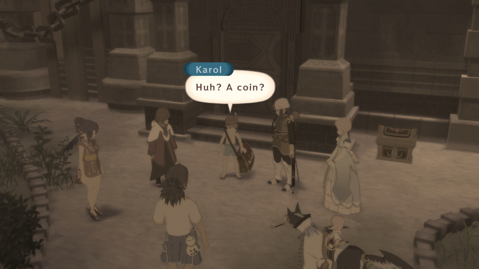

- [ ] In Phaeroh's Crag, approach the Phantom Rift and visit Yormgen. Speak with the Sage in the NW House. Head to Dahngrest and exit out. Fly toward the south of Yumanju and you will discover the __Labyrinth of Memories__. Gather __15 Fake Galds__ to meet __Traitor to Heaven (Kratos from Tales of Symphonia)__. Defeat him to receive __Letter of Challenge (Legend)__ which will unlock __The Mysterious 200 Man Melee__ if you have cleared 100 Man Melee with at least three characters (Extra Dungeon Final Part)
- [ ] Unlock 200 Man Melee and if you have cleared __Tag Team Tournament - Hero__, you will unlock __Tag Team Tournament - Savage__. Clear it for __Limit Octet__ (PS3 and Definitive Edition)
- [ ] If you have completed all Secret Missions in the same playthrough, speak with Flynn in Aurnion for Yuri's __True Knight__ title. In the PS3 and Definitive Edition, you need to sleep at the Inn instead (True Knight)
- [ ] In Yumanju, equip everyone with __the Hotspring Series titles__ and speak with the Receptionist (Hotspring Final Part)

- [ ] Visit every location on the World Map including the __Aer Krenes and Labyrinth of Memories including Sunken Grotto, Necropolis of Nostalgia and The City of the Waning Moon in the PS3 and Definitive Edition__. Sleep at the King Of Adventure to get Estelle's __Curious Princess__ title (Curious Princess)
- [ ] Once you have seen all 12 Friends of Patty's Mystic Artes __Summon Friends__, enter Nordopolica and head toward the north. On the way, you will see Gim on the stairs. Talk to him and Patty will obtain the __Successor Of The Great Pirate's Name__ title (PS3 and Definitive Edition)
- [ ] You can now go down further in the __Necropolis of Nostalgia__ to face the toughest boss in Tales of Vesperia, __Spiral Draco__. Forget about Fell Arms as it is useless against this boss! (PS3 and Definitive Edition)
