# Recipes Checklist for Tales of Vesperia
- Author: [@tauke](https://twitter.com/tauke)
- Last updated: 12 July 2020
- Source: [How to Unlock All Cooking Recipes](https://steamcommunity.com/sharedfiles/filedetails/?id=1621018067)

## Quick Glance
This checklist are sorted by characters who can unlock new recipes after cooking certain recipes repeatedly.

For the likes/dislikes and benefit, please refer to the source.

The Wonder Chef list will can be found at the bottom of the guide.

> _Just in case, keep cooking repeatedly if you're feeling like it is not unlocking the recipe..._

## Characters

### Yuri
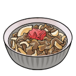

- [ ] __Beef Bowl__: Cooked ___Rice Ball___ repeatedly.

- [ ] __Pudding__: Cooked ___Sorbet___ repeatedly.

- [ ] __Cake__: Cooked ___Pudding___ repeatedly.

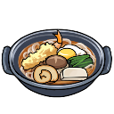

- [ ] __Udon Noodles Hot Pot__: Cooked ___Pork Miso Soup___ repeatedly.

### Estelle

- [ ] __Rice Ball__: Cooked ___Sandwich___ repeatedly.

- [ ] __Scottish Egg__: Cooked ___Fried Chicken and Fries___ repeatedly.

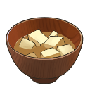

- [ ] __Miso Soup__: Cooked ___Minestrone Soup___ repeatedly.

- [ ] __Clam Chowder__: Cooked ___Miso Soup___ repeatedly.

- [ ] __Pork Miso Soup__: Cooked ___Vichyssoise___ repeatedly.

### Repede

- [ ] __Dog Food__: Cooked ___woof Any Recipe woof___.

### Karol

- [ ] __Omelette Rice__: Cooked ___Beef Bowl___ repeatedly.

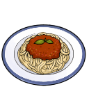

- [ ] __Meat Sauce__: Cooked ___Omelette Rice___ repeatedly.

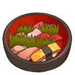

- [ ] __Sushi__: Cooked ___Sashimi___ repeatedly.

### Rita

- [ ] __Vegetable Stir Fry__: Cooked ___Salad___ repeatedly.

- [ ] __Fruit Parfait__: Cooked ___Crepe___ repeatedly.

### Raven

- [ ] __Pork Stew__: Cooked ___Beef Bowl___ repeatedly.

- [ ] __Okonomiyaki__: Cooked ___Scottish Egg___ repeatedly.

- [ ] __Sashimi__: Cooked ___Salad___ repeatedly.

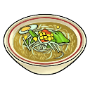

- [ ] __Soup Noodles__: Cooked ___Vegetable Stir Fry___ repeatedly.

### Judith
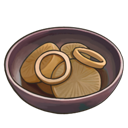

- [ ] __Japanese Stew__: Cooked ___Pork Stew___ repeatedly.

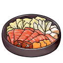

- [ ] __Sukiyaki__: Cooked ___Japanese Stew___ repeatedly.

- [ ] __Tempura__: Cooked ___Croquette___ repeatedly.

### Patty

- [ ] __Skewers__: Cooked ___Miso Soup___ repeatedly.

- [ ] __Fisherman's Hot Pot__: Cooked ___Seafood Bowl___ repeatedly.

### Flynn

- [ ] __Steak__: Cooked ___Salisbury Steak___ repeatedly.

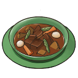

- [ ] __Beef Stew__: Cooked ___Cream Stew___ repeatedly.

## Events
The following recipes can be obtained from the Wonder Chef who disguises at various locations.

### Wonder Chef
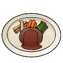

- [ ] __Salisbury Steak__ (Aspio)

- [ ] __Sorbet__ (Capua Nor)

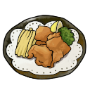

- [ ] __Fried Chicken and Fries__ (Capua Torim)

- [ ] __Fish with Miso Sauce__ (Heliord)

- [ ] __Minestrone Soup__ (Dahngrest)

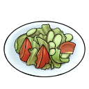

- [ ] __Salad__ (Ghasfarost)

- [ ] __Kebab Sandwich__ (Nordopolica)

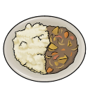

- [ ] __Curry__ (Mantaic)

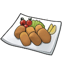

- [ ] __Croquette__ (Yormgen)

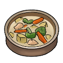

- [ ] __Cream Stew__ (Myorzo)

- [ ] __Vichyssoise__ (Bamco _I mean_ Nam Cobanda Isle)

- [ ] __Crepe__ (Aurnion)

- [ ] __Mabo Curry__ (Nordopolica - Have all other recipes)

### Other Recipes

- [ ] __Sandwich__ (First recipe unlock through the course of the story)

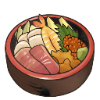

- [ ] __Seafood Bowl__ (Heliord (Chevalier's HQ ) -> Capua Nor (Outside Inn))

- [ ] __Seafood Stew__ (Capua Torim -> Dahngrest -> Capua Torim)
